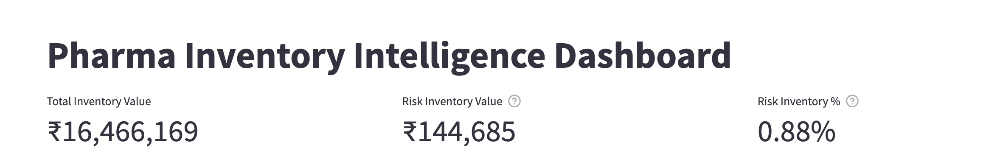
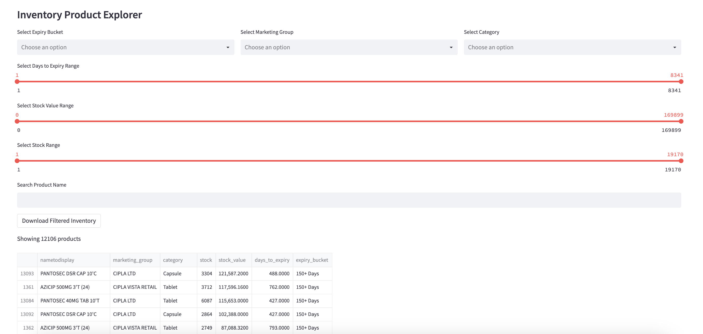
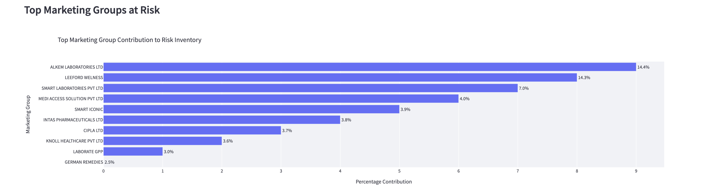

Pharma Inventory Intelligence Dashboard
Interactive inventory analytics dashboard built using Streamlit, Pandas, 
and Plotly.
Business Problem
Pharmaceutical inventory often contains products approaching expiry, 
creating financial risk and potential wastage. This dashboard helps 
identify and monitor inventory at risk through expiry-based analytics and 
interactive exploration.
Features
* Inventory Value KPIs
* Risk Inventory Monitoring
* Expiry Bucket Segmentation
* Marketing Group Risk Analysis
* Product Explorer with Dynamic Filters
* Product Search
* CSV Export
Technology Stack
* Python
* Pandas
* Streamlit
* Plotly
Dashboard Screenshots
KPI Overview

Inventory Distribution by Expiry Window

![Risk 
Pharma Inventory Intelligence Dashboard
Interactive inventory analytics dashboard built using Streamlit, Pandas, 
and Plotly.
Business Problem
Pharmaceutical inventory often contains products approaching expiry, 
creating financial risk and potential wastage. This dashboard helps 
identify and monitor inventory at risk through expiry-based analytics and 
interactive exploration.
Features
* Inventory Value KPIs
* Risk Inventory Monitoring
* Expiry Bucket Segmentation
* Marketing Group Risk Analysis
* Product Explorer with Dynamic Filters
* Product Search
* CSV Export
Technology Stack
* Python
* Pandas
* Streamlit
* Plotly
Dashboard Screenshots
KPI Overview

Inventory Distribution by Expiry Window

Product Explorer

Top Marketing Groups at Risk

Future Enhancements
* Gmail API Integration
* Automated Inventory Report Ingestion
* Expiry Forecasting
* Inventory Risk Alerts
* AI Generated Insights

