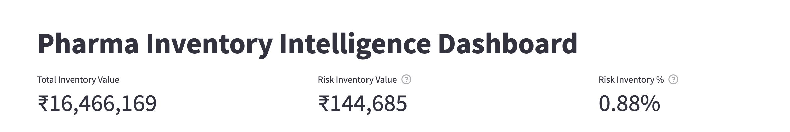
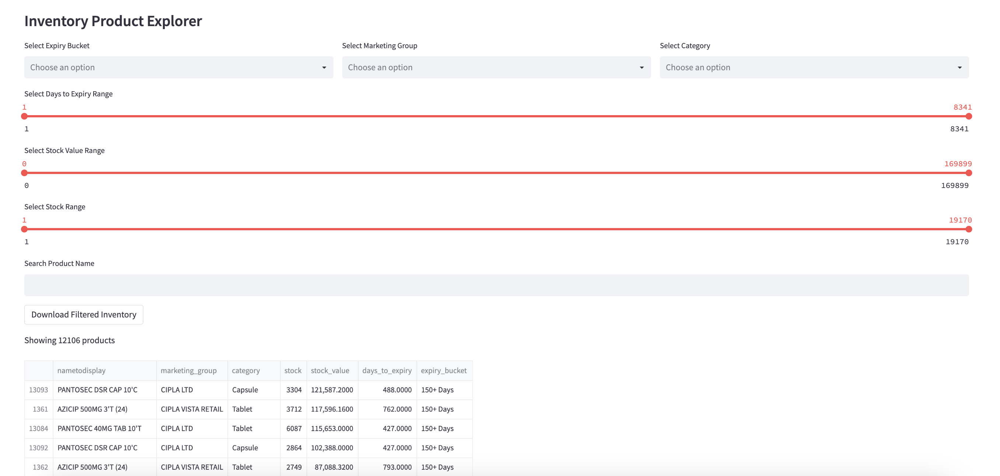
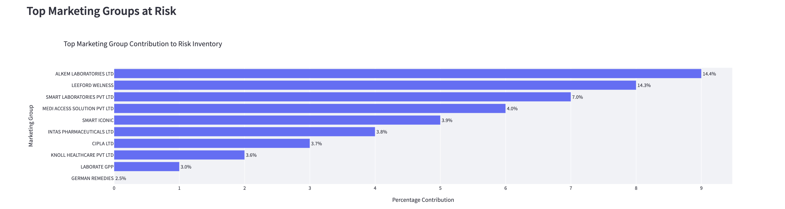

# Pharma Inventory Intelligence Dashboard

## Overview

An end-to-end inventory analytics dashboard built using Streamlit, Pandas, 
Plotly, and the Gmail API.

The application automatically retrieves the latest inventory report from 
Gmail or allows manual file uploads, then provides actionable inventory 
insights including expiry risk analysis, product exploration, and 
inventory monitoring.

---

## Live Demo

Streamlit App:

https://pharma-inventory-intelligence-dashboard-yyqrj7igpsxxrxgjmb7sm6.streamlit.app/

---

## Features

### Inventory Analytics

* Inventory risk analysis
* Expiry window distribution
* Product-level inventory exploration
* Marketing group risk analysis
* Interactive visualizations

### Automated Gmail Integration

* Connects to Gmail using OAuth2
* Retrieves the latest email with subject:

  * Stock Detail
* Downloads the latest inventory attachment automatically
* One-click refresh from Gmail
* Displays:

  * Email subject
  * Email received timestamp
  * Attachment name

### Data Sources

Users can choose between:

1. Upload Inventory File
2. Load Latest Inventory From Gmail

---

## Technology Stack

### Frontend

* Streamlit

### Data Processing

* Pandas
* NumPy

### Visualization

* Plotly

### File Handling

* openpyxl
* xlrd

### Integrations

* Gmail API
* Google OAuth2

### Deployment

* Streamlit Community Cloud

---

## Dashboard Screenshots

### KPI Overview



### Inventory Distribution by Expiry Window


### Product Explorer



### Top Marketing Groups at Risk



---

## Project Architecture

Inventory Email
↓
Gmail API
↓
Attachment Download
↓
Excel Processing
↓
Pandas Transformations
↓
Interactive Dashboard
↓
Business Insights

---

## Local Installation

### Clone Repository

```bash
git clone 
https://github.com/sonalgarg20920/pharma-inventory-intelligence-dashboard.git

cd pharma-inventory-intelligence-dashboard
```

### Install Dependencies

```bash
pip install -r requirements.txt
```

### Run Application

```bash
streamlit run app.py
```

---

## Gmail Integration

The application supports automated inventory refresh using Gmail.

Authentication is implemented using:

* Google OAuth2
* Gmail API
* Refresh Tokens

For security purposes:

* OAuth credentials are not stored in the repository
* Secrets are managed securely
* Token files are excluded using .gitignore

---

## Business Value

This dashboard helps organizations:

* Monitor inventory health
* Identify expiring products
* Reduce inventory losses
* Improve inventory visibility
* Automate inventory reporting workflows

---

## Future Enhancements

* Inventory trend analysis
* Historical inventory tracking
* Email scheduling and alerts
* Automated expiry notifications
* Inventory forecasting

---

## Author

Sonal Garg

Data Analytics | Business Intelligence | Data Engineering

GitHub:
https://github.com/sonalgarg20920

